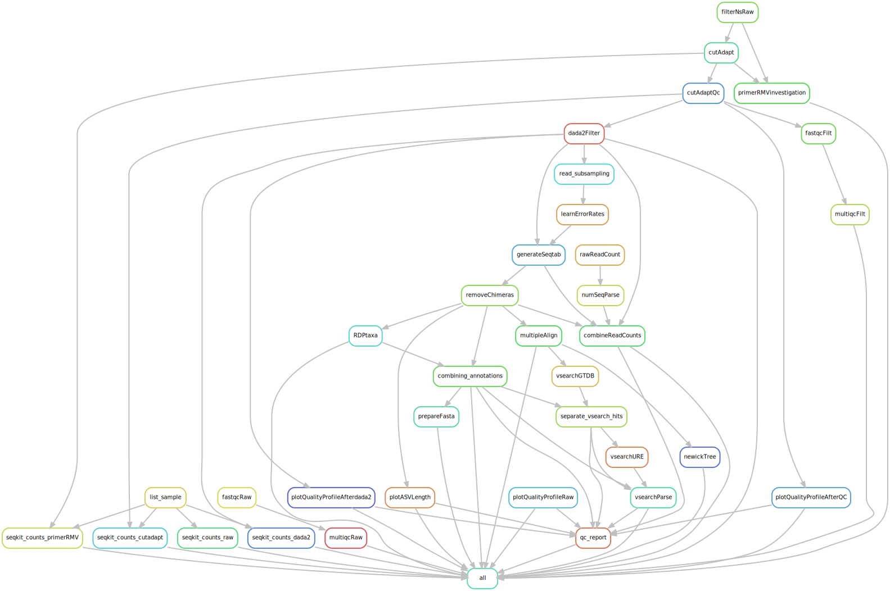

# FemMicro16S
## Advancing the science of women’s health through open data sharing


[](https://docs.conda.io/en/latest/)
[](https://snakemake.bitbucket.io)
[](https://benjjneb.github.io/dada2/index.html)


This is a snakemake workflow for profiling microbial communities from amplicon sequencing
data using dada2. DADA2 tutorial can be found from https://benjjneb.github.io/dada2/index.html. The initial code was cloned from https://github.com/SilasK/amplicon-seq-dada2 and heavily modified to make this workflow suitable for our needs.

<br>

In this pipeline, species-level taxonomy assignment is performed using two complementary methods: DADA2 and VSEARCH and incorporates annotations from different databases: GTDB, Silva, RDP, and a vaginal field-specific database (URE).

1- DADA2: it uses a naive Bayesian classifier method (https://pubmed.ncbi.nlm.nih.gov/17586664) combined with a strict 100% nucleotide identity requirement between query ASVs and reference sequences. In this pipeline, four databases were used during the DADA2 classification step; however, for the final taxonomy, we retained GTDB-based assignments, and when GTDB did not provide an annotation for an ASV, we fell back to the corresponding URE annotation.


2- VSEARCH: it is an open-source alternative to USEARCH that performs optimal global sequence alignments between query ASVs and reference sequences at user-defined identity thresholds (supports adjustable (non-100%) identity thresholds).
For a more comprehensive understanding of this methodology, please refer to the paper available at https://www.ncbi.nlm.nih.gov/pmc/articles/PMC5075697/ and the manual at https://github.com/torognes/vsearch/releases/download/v2.27.0/vsearch_manual.pdf. In this pipeline, VSEARCH classifications were generated using the GTDB database, and when GTDB lacked species information for a given ASV, the corresponding URE annotation was used instead.

When integrating taxonomy assignments from VSEARCH and DADA2, we prioritized VSEARCH-derived annotations over the DADA2 RDP classifications, and GTDB-based annotations over those obtained from the field-specific URE database. In cases where the taxonomy_final entry originated from VSEARCH but the species (spp) field was missing (NA), we substituted the corresponding DADA2 species-level annotation. This strategy leverages the strengths of both methods and both databases, resulting in more complete and accurate taxonomic assignments across ASVs.


At the end of the workflow, we generate two versions of taxonomy annotation files, allowing users to choose the format that best fits their downstream analysis:

dada2_all_databases_merged.csv
Contains taxonomic annotations from all databases side by side (e.g., GTDB, SILVA, RDP, uRE), without combining or prioritizing them.
This file is useful for users who want to compare database outputs directly.

vsearch_dada2_merged.tsv
Provides a single, merged annotation per ASV by combining VSEARCH and DADA2 results from two main databases: the GTDB reference database and a vaginal field-specific database (URE).


**So in summary:**

We offer the option to incorporate a field-specific database into the pipeline (e.g., host- or environment-specific reference sets). When enabled, this database is prioritized after GTDB in both the VSEARCH and DADA2 workflows.

For each ASV, the assignment workflow proceeds as follows:

1- If VSEARCH assigns a taxonomy using GTDB → use it.

2- If there is no GTDB VSEARCH hit → run VSEARCH with the user-provided field-specific database (URE when URE=TRUE).

3- If no VSEARCH annotation is found → check dada2_gtdb for any level of assignment.

4- If still unresolved → attempt classification with dada2_URE (when URE=TRUE).

5- If VSEARCH annotation exists but spp is missing → fall back to DADA2.

This multi-stage approach ensures the most complete and accurate taxonomic resolution possible, while providing flexibility depending on project needs.


<br>

## Overview

Input: 
* Raw paired-end fastq files
* samples.tsv [example](example_files/samples.tsv)

Output:
For more details on output files please check section 4.

* Taxonomy assignment tables
* ASV abundance table
* Summary of reads count at each step of the ppipeline
* ASV sequences in a fasta format
* A phylogenetic tree
* A QC report file

<br> 

## Pipeline summary



<br> 

Certain rules are executed only when their corresponding parameters are set to True in the configuration file.

The **filterNsRaw** and **primerRMVinvestigation** rules are used to examine primers in reads both before and after removal and are triggered if the **primer_removal** parameter is set to True.

The **read_subsampling** rule is performed when the **subsample** parameter is set to True, allowing error rates to be learned from a larger set of samples.

Lastly, the **vsearchURE** rule is executed if the **URE_after_GTDB** parameter is set to True, enabling the use of the URE database to annotate ASVs that could not be assigned using GTDB.

<br>
<br>


## Steps:

1-	**Cutadapt**: primer removal (if needed) and quality trimming of the reads.
<br>
<br> 

2-	**DADA2**: filtering and trimming reads for quality, dereplicating for reducing computational complexity, estimating error rate to distinguish true biological variants, sample inference identifying true sequences and fixing errors, merging paired-end reads, removing chimera and finally assigning taxonomy (using naive Bayesian classifier method with a 100% nucleotide identity match between the reference sequences and the query) and constructing a phylogenetic tree.
<br> 
<br> 

3-	**VSEARCH**: assigning taxonomy by performing optimal global sequence alignments for the query against potential target sequences with an adjustable identity threshold (pipeline default: 99.3%).
<br> 
<br> 

Note: Results from different tools such as fastqc, multiQC, seqkit, and dada2 were employed for quality control assessment at different points of the pipeline.

<br> 


## Workflow

<details>
<summary><h3 style="font-size: 24px;">1. Prerequisites</h3></summary>
    
Please install the following tool before running this workflow. Please request an interactive session before starting the installation step by running the following command:

```bash
    salloc --mem=20G --time=05:00:00
```

conda (miniconda): https://conda.io/projects/conda/en/stable/user-guide/install/linux.html

</details>


<details>

<summary><h3 style="font-size: 24px;">2. Setting up environments</h3></summary>

### 2.1. Installing Tools Using Apptainer/Singularity (Containerized Setup, recommended)
In the main Snakemake directory (where the Snakefile is located), create a new folder named apptainer.
Navigate into this folder and download the required environment files using the commands provided below.


```bash

apptainer pull qc-1.0.0.sif library://saharbagheri/femmicro16s/qc:1.0.0

apptainer pull dada2-1.0.0.sif library://saharbagheri/femmicro16s/dada2:1.0.0

apptainer pull rmd-1.0.0.sif library://saharbagheri/femmicro16s/rmd:1.0.0

apptainer pull vsearch-1.0.0.sif library://saharbagheri/femmicro16s/vsearch:1.0.0

apptainer pull fastree_mafft-1.0.0.sif library://saharbagheri/femmicro16s/fastree_mafft:1.0.0

```

Make sure to adjust the file names if you are using newer image versions or if your previous setup relied on local Conda environments. To do this, update all Snakemake rules in FemMicro16S/utils/rules/ so that they reference either your local environments or the appropriate .sif files in the apptainer/ folder. The default configuration now uses the Apptainer images.

For example, change:

```bash
conda: "dada2" #a local environment
```
to 

```bash
apptainer: "apptainer/dada2-1.0.0.sif" #an apptainer image
```


### 2.2. Manual Installation of Tools and Dependencies
You can also set up all environments and install the tools manually if you need to use specific tool versions.

Note: 
After installation, verify the installation of each tool by executing its name followed by the flag '-h'. For example, use fastqc -h to check if FastQC is installed. This command should display the help information or usage instructions for the tool, indicating successful installation.

For packages installed in R, initiate an R session within the same environment. Confirm the package installation by executing the library("package name") command, replacing "package name" with the actual name of the package. This will load the package in R, showing that it is properly installed and accessible in the current environment.


#### 2.2.1 snakemake environment

```bash
conda activate base

conda install -c conda-forge mamba

mamba create --name snakemake

mamba activate snakemake

mamba install -c conda-forge -c bioconda snakemake==7.32.4

pip install pyyaml
```
<br>

#### 2.2.2 dada2 environment

To install r:

```bash
conda create -n dada2 -c conda-forge r-base=4.4.3
conda install -n dada2 -c conda-forge -c bioconda bioconductor-dada2=1.34.0
```

To activate the environment and install the required packages (dplyr, gridExtra, ggplot2, DECIPHER, Biostrings, limma) locally in R:

```bash
conda activate dada2
conda install bioconda::seqtk
```

to open an R session within the dada2 environment type R, (dada2) [username@hostname ~]$ R


```bash
install.packages("gridExtra")
install.packages("ggplot2")
install.packages("dplyr")
if (!require("BiocManager", quietly = TRUE))
    install.packages("BiocManager")
BiocManager::install("DECIPHER")
BiocManager::install("Biostrings")
BiocManager::install("limma")
```

to quit R type q(), (dada2) [username@hostname ~]$ q() and deactivate the environment:

```bash
conda deactivate
```

<br>

#### 2.2.3 QC environment

To install fastqc, multiQC, cutadapt, and seqkit tools for quality control in a new environment:

```bash
conda create --name QC
conda activate QC
conda install -c bioconda fastqc==0.11.8
conda install pip
pip install multiqc
pip install pandas==1.5.3
pip install cutadapt
conda install -c bioconda seqkit
conda deactivate
```

<br>

#### 2.2.4 fastree_mafft environment 

To create an environment for generating a phylogenetic tree and a fasta file of ASVs:

```bash
conda create -n fastree_mafft
conda activate fastree_mafft
conda install -c bioconda fasttree
conda deactivate
```

<br>

#### 2.2.5 rmd environment

```bash
conda create -n rmd
conda activate rmd
conda install -c conda-forge r-base
conda install -c conda-forge pandoc
conda install -c conda-forge r-tidyverse
conda install bioconda::bioconductor-dada2
conda install conda-forge::r-kableextra
conda install conda-forge::r-ggpubr
wget https://github.com/marbl/Krona/releases/download/v2.8.1/KronaTools-2.8.1.tar 
tar xf KronaTools-2.8.1.tar 
cd KronaTools-2.8.1
#prefix destination path is relative to where KronaTools-2.8.1 is downloaded
./install.pl --prefix=/path/where/rmd/environment/is/ #e.g.: /softwares/miniconda/envs/rmd/
```

to open an R session within the rmd environment type R, (rmd) [username@hostname ~]$ R

```bash
install.packages('DT')
install.packages("ggplot2")
install.packages("dplyr")
if (!require("BiocManager", quietly = TRUE))
    install.packages("BiocManager")
BiocManager::install("phyloseq") #This takes a while
install.packages("remotes")
remotes::install_github("cpauvert/psadd")
BiocManager::install("limma")
install.packages("RColorBrewer")
install.packages("waterfalls")
install.packages("plotly")
```

to quit R type q(), (rmd) [username@hostname ~]$ q() and deactivate the environment:

```bash
conda deactivate
```

<br>

#### 2.2.6 vsearch environment

```
conda create -n vsearch
conda activate vsearch
conda install -c "bioconda/label/cf201901" vsearch
conda deactivate
```

</details>
 

<details>
<summary><h3 style="font-size: 24px;">3. Usage</h3></summary> 

Then please follow these steps to set up and run the pipeline.

#### 3.1 Make sure that all the environments are set up and required packages are installed.
<br>

#### 3.2 Navigate to your project directory and clone this repository into that directory using the following command:
<br>

```bash
git clone https://github.com/SycuroLab/FemMicro16S.git
```

#### 3.3 Use prepare.py script to generate the samples.tsv file as an input for this pipeline using the following command: 
<br>

```<DIR>``` is the location of the raw fastq files.

```bash
python utils/scripts/common/prepare.py <DIR>
```

#### 3.4 Make sure to configure the config.yaml file.
<br>

| Parameter | Description | Example/Default |
| -------------- | --------------- | ------------ |
| input_dir | path of the input directory | "/home/data" |
| output_dir | name and path to the output directory | "output" |
| path | path to the main snakemake directory | "/home/analysis/dada2_snakemake_workflow" |
| forward_read_suffix, reverse_read_suffix | Forward and reverse reads format | "_R1" "_R2" |
| primer_removal | Set to TRUE to remove primers | False |
| fwd_primer | Forward primer sequence | "CTGTCTCTTAT..." |
| rev_primer | Reverse primer sequence | "CTGTCTCTTAT..." |
| fwd_primer_rc | Forward primer reverse complement sequence | "CTGTCTCTTAT..." |
| rev_primer_rc | Reverse primer reverse complement sequence | "CTGTCTCTTAT..." |
| min_overlap | minimum overlap length for primer detection | 15 |
| max_e | maximum error rate allowed in primer match/detection | 0.1 |
| qf, qr | quality trimming score | numeric e.g. 20 |
| min_len | minimum length of reads kept | numeric e.g. 50 |
| Positive_samples | Positive control samples to visualize in qc report | "pos_ctrl_1\\|pos_ctrl_2" |
| threads | number of threads to be used | numeric e.g. 20 |
| truncLen | trimming reads at this length | numeric e.g. 260, separately set for forward and reverse reads |
| maxEE | After truncation, reads with higher than maxEE "expected errors" will be discarded. Expected errors are calculated from the nominal definition of the quality score: EE= sum(10^(-Q/10)) | numeric e.g. 2, separately set for forward and reverse reads  |
| truncQ | Truncating reads at the first instance of a quality score less than or equal to truncQ | 2 |
| subsample | Subsampling reads for learning error rates | True |
| subsample2LearnErrorRate | Percentage of reads from each sample to be used | 0.2 |
| learn_nbases | minimum number of total bases to use for error rate learning | 100000000 |
| chimera_method | method used for chimera detection | consensus |
| Identity | minimum percent identity for a hit to be considered a match | percentage e.g. 0.993 |
| Maxaccepts | maximum number of hits to consider per query | numeric e.g. 30 |
| URE_after_GTDB | running URE after GTDB using VSEARCH taxonomy assignment | False |
| RDP_dbs, vsearch_DBs | databases used for taxonomy assignment | |

<br>

#### 3.5 Download the taxonomy databases from http://www2.decipher.codes/Downloads.html that you plan to use in utils/databases/ and consequently set the path for them in the config file

#### 3.6 Once confident with all the parameters first run the snakemake dry run command to make sure that pipeline is working.
 <br>

⚠️ **Note: Please make sure to change parameters in dada2_sbatch.sh and cluster.json files based on your SLURM HPC cluster resources before running the pipeline.**


 ```bash
#For a local snakemake environment
snakemake -np

```

Then snakemake can be executed by the following bash script:
 
```bash
sbatch dada2_sbatch.sh #when snakemake is a local environmnet

```
</details>


<details>
<summary><h3 style="font-size: 24px;">4. Output files and logs</h3></summary> 
 
To make sure that the pipeline is run completely, we need to check the log and output files.

| Path | File | Description |
| -------------- | --------------- | ------------ |
| . | record_dada2.id.err,record_dada2.id.out | report of pipeline run duratuion and reason if pipeline stopped running |
| ./logs | file.out, file.err | All pipeline steps' log files showing output and possible errors |
| ./output/snakemake_files | snakemake result files | A copy of all snakemake files and logs to avoid rewritting them by upcoming re-runs |
| ./output/dada2 | seqtab_nochimeras.csv| ASVs abundance across sampels |
| ./output/dada2 | Nreads.tsv | Read count at each step of the QC and following dada2 pipeline |
| ./output/phylogeny | ASV_seq.fasta | Fasta sequences of the ASVs generated (headers are the same as the sequences) |
| ./output/phylogeny | ASV_tree.nwk | Phylogenetic tree in newick format |
| ./output/QC_html_report | qc_report.html | Quality, counts and length distribution of reads, prevalence/abundance and length distribution of ASVs in all samples, all samples bacterial composition profile |
| ./output/taxonomy | GTDB_RDP.tsv, GTDB_RDP_boostrap.rds | RDP classified annotations using GTDB DB and taxonomy assignmnet scores out of 100 |
| ./output/taxonomy | RDP_RDP.tsv, RDP_RDP_boostrap.rds | RDP classified annotations using RDP DB and taxonomy assignmnet scores out of 100 |
| ./output/taxonomy | Silva_RDP.tsv, Saliva_RDP_boostrap.rds | RDP classified annotations using Saliva DB and taxonomy assignmnet scores out of 100 |
| ./output/taxonomy | URE_RDP.tsv, URE_RDP_boostrap.rds | RDP classified annotations using URE DB and taxonomy assignmnet scores out of 100 |
| ./output/taxonomy | annotation_combined_dada2.txt | ASV abundance and their annotation from all 4 databases (GTDB, RDP, Saliva, URE) side by side across samples |
| ./output/vserach/GTDB/ | Vsearh_GTDB_raw.tsv | Raw output result from vsearch with tab-separated uclust-like format using GTDB database |
| ./output/vsearch/URE/ | Vsearh_URE_raw.tsv | Raw output result from vsearch with tab-separated uclust-like format using URE database only for ASVs that were not annotated by vsearch using GTDB DB |
| ./output/vsearch/ | vsearch/Final_uncollapsed_output.tsv | Vsearch assignment for ASVs, hits in separate rows |
| ./output/vsearch/ | vsearch/Final_colapsed_output.tsv | Vsearch assignment for unique ASVs per row with different hits at species level collapsed |
| ./output/taxonomy/ | vsearch_output.tsv | Taxonomy assignmnet reaults using vsearch and GTDB |
| ./output/taxonomy | vsearch_dada2_merged.tsv | merged vsearch (GTDB/URE) and dada2 annotations (GTDB/RDP?Silva/URE), corresponding abundance across samples, and final annotation with priority of vsearch (GTDB then URE, if GTDB annotation is NA) over dada2 (GTDB then URE) |
| ./output/primer_status | primer_existance_raw.csv , primer_existance_trimmed.csv | Files to show primers existance before and after primer removal, if applicable |


</details>

<details>
<summary><h3 style="font-size: 24px;">5. Version Check</h3></summary> 

If you are using local environments, you can check the tool versions by running:

`bash Version_check.sh`

If you used different names for your local environments, please update them accordingly inside the bash script before running it.


If you are using Apptainer images, you can also check the tool versions by running:

`bash Version_check_apptainer.sh`

Please make sure the tool versions referenced in the script match the versions of the images you have downloaded.

</details>
